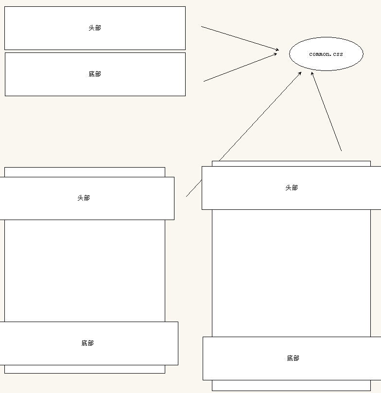
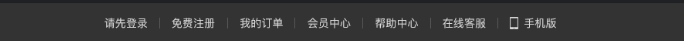
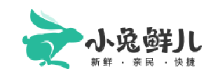
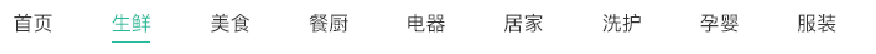
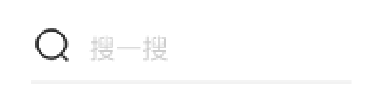

# 模块化开发

我们很多页面的头部和底部都是相同的，所以开发的时候，我们可以单独把头部和底部开发出来，其他的页面直接引用就可以。

单独写结构， 单独写样式(单独的一个css文件)    common.css

# MD 笔记小技巧

1.  #  空格  一级标题 回车     ##  二级标题    ###  三级标题  ......
2.  给我们的笔记插入图片。  我们截图可以直接复制到md笔记里面。  
3. 书写代码   ~~~css   按下回车

# 一、 创建common样式文件

### 1.1 页面版心

pc每个网站都有固定版心， 页面的宽度 居中对齐， 我们写代码之前必须先要确定页面的版心。

因为很多的盒子都需要版心，我们完全可以写一个公共的类， 谁需要，谁调用

~~~css
/* 这个css文件主要是设置头部和底部的样式 */
/* 版心  container  .w  */
.container {
    width: 1240px;
    margin: 0 auto;
}

~~~

# 二、header 网页的头部模块制作

头部模块分为上下2个盒子

### 2.1  top-nav 上导航栏

 

结构：

~~~html
  <!-- 1. 顶部导航 -->
        

            <!-- 版心 -->
            

                <ul>
                    <li><a href="#">请先登录</a></li>
                    <li><a href="#">免费注册</a></li>
                    <li><a href="#">我的订单</a></li>
                    <li><a href="#">会员中心</a></li>
                    <li><a href="#">在线客服</a></li>
                    <li><a href="#">帮助中心</a></li>
                    <li><a href="#">手机版</a></li>
                </ul>
            

        

~~~

移动ul到右侧，然后把小li水平排列

css部分

~~~css
/* 头部模块制作 */
.top-nav {
    height: 52px;
    line-height: 52px;
    background-color: #333333;
}

.top-nav ul {
    float: right;
}
.top-nav ul li {
    float: left;
}
.top-nav ul li a {
    color: #dcdcdc;
    padding: 0 15px;
    border-right: 1px solid #666666;
    
}
.top-nav ul li a:hover {
     color: #5eb69c;
}
.top-nav ul li:last-child a {
    border-right: 0;
}
.top-nav ul li:last-child a::before {
    content: '';
    display: inline-block;
    width: 11px;
    height: 16px; 
    margin-right: 8px;
    margin-top: -3px;
    vertical-align: middle;
    background: url(../images/sprites.png) no-repeat -160px -70px;
}
~~~

### 2.2  main-nav 主导航

一定要放到 上导航栏的下面，结构看仔细。

html结构：

~~~html
<!-- 2. 主导航 -->
        

            <!-- 版心 -->
            

                123
            

        

~~~

css部分：

~~~css
/* 主导航模块 */
.main-nav {
    height: 130px;
    background-color: pink;
}

~~~

#### 2.2.1  logo模块制作

 

命名为 logo 。 注意这个盒子需要往下移动使用什么合适？  使用margin-top 会发生外边距塌陷的问题。

**注意啦：  如果logo盒子浮动、定位（脱标了） 则不会发生外边距塌陷的问题。**

优化注意事项：

1.  里面嵌套一个h1标签，为了提升重要性

2. 继续在h1里面在套一个 链接 a  ，这样用户可以点击，但是这个a需要设置和父亲一样大。别忘了转换为块级元素

3. 如何隐藏logo链接里面的文字呢？   

   1. font-size: 0;  京东的做法   
   2.  text-indent:-999px;  overflow:hidden;  淘宝的做法

4. 给链接添加 title 属性 

5. 把背景图片给链接  

   ​

html部分

~~~html
 <!-- 1. logo -->
                

                    <h1>
                        <a href="#" title="小兔仙儿官网">小兔鲜</a>
                    </h1>
                

~~~

css部分

~~~css
/* logo模块 */
.logo {
    float: left;
    width: 207px;
    height: 70px;
    margin-top: 30px;
}
.logo a {
    display: block;
    width: 207px;
    height: 70px;
    /* 1.隐藏文字 */
    /* font-size: 0; */
    /* 2. 隐藏文字 */
    text-indent: -9999px;
    overflow: hidden;
    background: url(../images/logo.png) no-repeat;
    /* 把背景图片缩放大小 和盒子一样大 */
    background-size: 207px 70px;
}

~~~

#### 2.2.2 nav 导航模块

html结构

~~~html
  <!-- 2. nav 导航 -->
                <nav class="nav">
                    <ul>
                        <li><a href="#">首页</a></li>
                        <li><a href="#">生鲜</a></li>
                        <li><a href="#">美食</a></li>
                        <li><a href="#">餐厨</a></li>
                        <li><a href="#">电器</a></li>
                        <li><a href="#">居家</a></li>
                        <li><a href="#">洗护</a></li>
                        <li><a href="#">孕婴</a></li>
                        <li><a href="#">服装</a></li>
                    </ul>
                </nav>
~~~

css样式

~~~css
/* nav部分 */
.nav {
    float: left;
    margin-left: 40px;
    margin-top: 56px;
}
.nav li {
    float: left;
    margin-right: 48px;
}
.nav li a {
    /* 因为a是行内元素不能直接给上下padding ，需要转换 */
    display: block;
    padding-bottom: 6px;
}
.nav li a:hover {
    border-bottom: 1px solid #27ba9b;
}
~~~

#### 2.2.3 search 搜索模块

 

html结构

~~~html
 <!-- 3. search 模块 -->
                

                    <input type="text" placeholder="搜一搜">
                

~~~

css 部分

~~~css
/* 搜索模块 */
.search {
    position: relative;
    float: left;
    width: 172px;
    height: 30px;
    background-color: skyblue;
    margin-top: 56px;
}
.search input {
    width: 100%;
    height: 100%;
    border-bottom: 2px solid #e7e7e7;
    padding-left: 30px;
}
.search::before {
    content: '';
    position: absolute;
    left: 0;
    top: 5px;
    width: 18px;
    height: 18px;
    background: url(../images/sprites.png) no-repeat -79px -70px;
}

~~~

#### 2.2.4  购物车模块

一个div 的盒子 cart  ， 因为可以点击，所以需要 a 链接  ， 里面的数字很重要，所以在套个盒子  

注意： 脱标的盒子（浮动和定位）他的大小就是内容的大小  

html结构

~~~html
 <!-- 4. 购物车 cart -->
                

                    <a href="#">
                        2
                    </a>
                

~~~

css样式

~~~css
/* cart 购物车模块 */
.cart {
    float: left;
    margin: 56px 0 0 15px;
}
.cart a {
    position: relative;
    display: block;
    width: 23px;
    height: 23px;
    background: url(../images/sprites.png) no-repeat -119px -70px;
}
.cart a span {
    position: absolute;
    top: -8px; 
    /* right: -14px; */
    left: 14px;
    padding: 0 6px;
    background-color: #e26237;
    color: #fff;
    font-size: 13px;
    border-radius: 8px;
}
~~~

# 三、footer 页面底部模块

footer 里面包含2个上下的大盒子   上面的 concat   

### 3.1 concat 合并模块

这里面4个dl 就可以， 宽度 1240 / 4  =  310 宽度 

dl 结构

~~~html
 <!-- 上 concat 模块 -->
        

            <!-- 版心 -->
            

                <dl class="service">
                    <dt>客户服务</dt>
                    <dd class="kefu">
                        在线客服
                    </dd>
                    <dd class="fankui">问题反馈</dd>
                </dl>
                <dl class="service">
                    <dt>客户服务</dt>
                    <dd class="kefu">
                        在线客服
                    </dd>
                    <dd class="fankui">问题反馈</dd>
                </dl>
            

        

~~~

css样式

~~~css
/* 页面底部模块 */
.concat {
    height: 300px;
    background-color: pink;
}
/* 我们只想让concat 里面的 container发生变化 */
.concat .container  {
    padding-top: 75px;
}
.concat .container dl {
    float: left;
    width: 310px;

    padding: 0 55px;
}
.concat .container dl dt {
    color: #999;
    text-align: center;
}
.concat .container dl dd {
    float: left;
    width: 92px;
    height: 92px;
    border: 1px solid #eee;
    margin-top: 35px;
    text-align: center;
}
.concat .container dl dd:nth-child(2) {
    margin-right: 5px;
   
}
.service dd::before {
    content: "";
    display: block;
    width: 29px;
    height: 27px;
    margin: 20px auto 10px;
}
.kefu::before {
    background: url(../images/sprites.png) no-repeat -250px -70px;
}
.fankui::before {
    background: url(../images/sprites.png) no-repeat -350px -70px;
}
~~~

