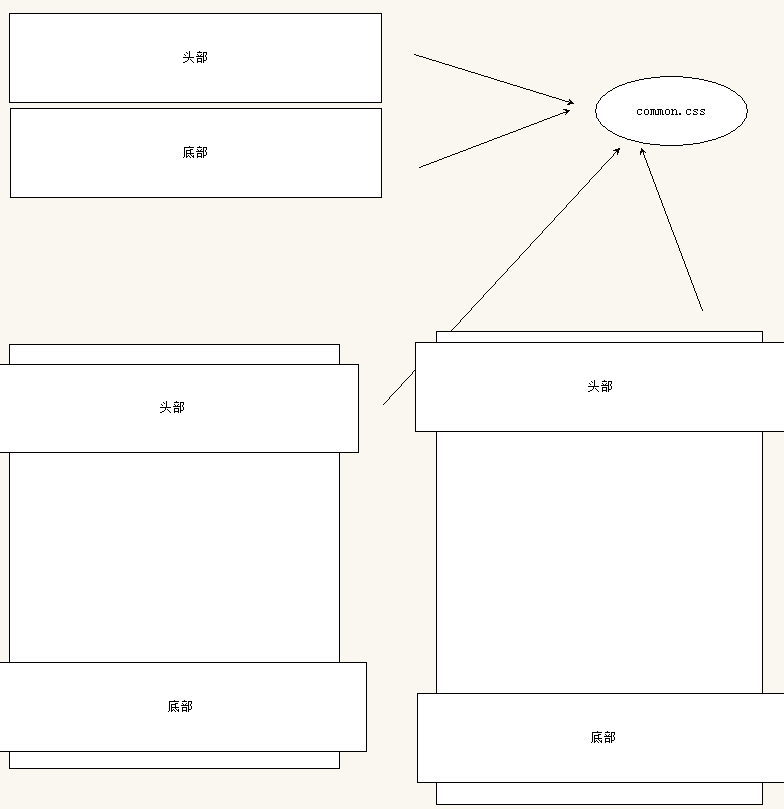
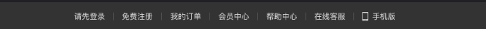
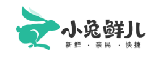
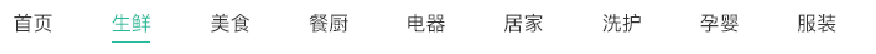
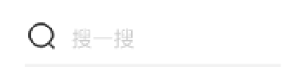
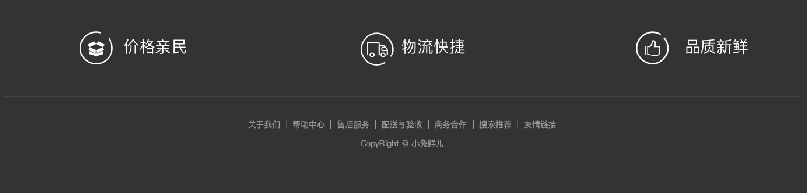
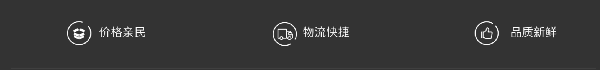
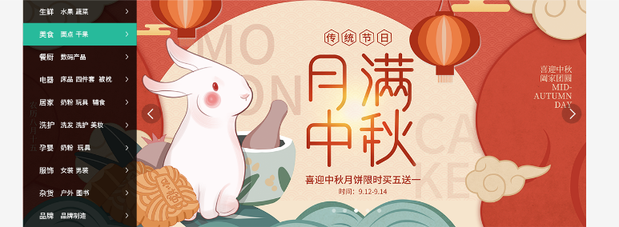
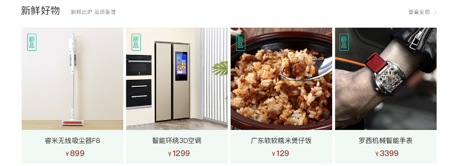

# 模块化开发

我们很多页面的头部和底部都是相同的，所以开发的时候，我们可以单独把头部和底部开发出来，其他的页面直接引用就可以。

单独写结构， 单独写样式(单独的一个css文件)    common.css

# MD 笔记小技巧

1.  #  空格  一级标题 回车     ##  二级标题    ###  三级标题  ......
2.  给我们的笔记插入图片。  我们截图可以直接复制到md笔记里面。  
3. 书写代码   ~~~css   按下回车

# 一、 创建common样式文件

### 1.1 页面版心

pc每个网站都有固定版心， 页面的宽度 居中对齐， 我们写代码之前必须先要确定页面的版心。

因为很多的盒子都需要版心，我们完全可以写一个公共的类， 谁需要，谁调用

~~~css
/* 这个css文件主要是设置头部和底部的样式 */
/* 版心  container  .w  */
.container {
    width: 1240px;
    margin: 0 auto;
}

~~~

# 二、header 网页的头部模块制作

头部模块分为上下2个盒子

### 2.1  top-nav 上导航栏

 

结构：

~~~html
  <!-- 1. 顶部导航 -->
        

            <!-- 版心 -->
            

                <ul>
                    <li><a href="#">请先登录</a></li>
                    <li><a href="#">免费注册</a></li>
                    <li><a href="#">我的订单</a></li>
                    <li><a href="#">会员中心</a></li>
                    <li><a href="#">在线客服</a></li>
                    <li><a href="#">帮助中心</a></li>
                    <li><a href="#">手机版</a></li>
                </ul>
            

        

~~~

移动ul到右侧，然后把小li水平排列

css部分

~~~css
/* 头部模块制作 */
.top-nav {
    height: 52px;
    line-height: 52px;
    background-color: #333333;
}

.top-nav ul {
    float: right;
}
.top-nav ul li {
    float: left;
}
.top-nav ul li a {
    color: #dcdcdc;
    padding: 0 15px;
    border-right: 1px solid #666666;
    
}
.top-nav ul li a:hover {
     color: #5eb69c;
}
.top-nav ul li:last-child a {
    border-right: 0;
}
.top-nav ul li:last-child a::before {
    content: '';
    display: inline-block;
    width: 11px;
    height: 16px; 
    margin-right: 8px;
    margin-top: -3px;
    vertical-align: middle;
    background: url(../images/sprites.png) no-repeat -160px -70px;
}
~~~

### 2.2  main-nav 主导航

一定要放到 上导航栏的下面，结构看仔细。

html结构：

~~~html
<!-- 2. 主导航 -->
        

            <!-- 版心 -->
            

                123
            

        

~~~

css部分：

~~~css
/* 主导航模块 */
.main-nav {
    height: 130px;
    background-color: pink;
}

~~~

#### 2.2.1  logo模块制作

 

命名为 logo 。 注意这个盒子需要往下移动使用什么合适？  使用margin-top 会发生外边距塌陷的问题。

**注意啦：  如果logo盒子浮动、定位（脱标了） 则不会发生外边距塌陷的问题。**

优化注意事项：

1.  里面嵌套一个h1标签，为了提升重要性

2. 继续在h1里面在套一个 链接 a  ，这样用户可以点击，但是这个a需要设置和父亲一样大。别忘了转换为块级元素

3. 如何隐藏logo链接里面的文字呢？   

   1. font-size: 0;  京东的做法   
   2.  text-indent:-999px;  overflow:hidden;  淘宝的做法

4. 给链接添加 title 属性 

5. 把背景图片给链接  

   ​

html部分

~~~html
 <!-- 1. logo -->
                

                    <h1>
                        <a href="#" title="小兔仙儿官网">小兔鲜</a>
                    </h1>
                

~~~

css部分

~~~css
/* logo模块 */
.logo {
    float: left;
    width: 207px;
    height: 70px;
    margin-top: 30px;
}
.logo a {
    display: block;
    width: 207px;
    height: 70px;
    /* 1.隐藏文字 */
    /* font-size: 0; */
    /* 2. 隐藏文字 */
    text-indent: -9999px;
    overflow: hidden;
    background: url(../images/logo.png) no-repeat;
    /* 把背景图片缩放大小 和盒子一样大 */
    background-size: 207px 70px;
}

~~~

#### 2.2.2 nav 导航模块

html结构

~~~html
  <!-- 2. nav 导航 -->
                <nav class="nav">
                    <ul>
                        <li><a href="#">首页</a></li>
                        <li><a href="#">生鲜</a></li>
                        <li><a href="#">美食</a></li>
                        <li><a href="#">餐厨</a></li>
                        <li><a href="#">电器</a></li>
                        <li><a href="#">居家</a></li>
                        <li><a href="#">洗护</a></li>
                        <li><a href="#">孕婴</a></li>
                        <li><a href="#">服装</a></li>
                    </ul>
                </nav>
~~~

css样式

~~~css
/* nav部分 */
.nav {
    float: left;
    margin-left: 40px;
    margin-top: 56px;
}
.nav li {
    float: left;
    margin-right: 48px;
}
.nav li a {
    /* 因为a是行内元素不能直接给上下padding ，需要转换 */
    display: block;
    padding-bottom: 6px;
}
.nav li a:hover {
    border-bottom: 1px solid #27ba9b;
}
~~~

#### 2.2.3 search 搜索模块

 

html结构

~~~html
 <!-- 3. search 模块 -->
                

                    <input type="text" placeholder="搜一搜">
                

~~~

css 部分

~~~css
/* 搜索模块 */
.search {
    position: relative;
    float: left;
    width: 172px;
    height: 30px;
    background-color: skyblue;
    margin-top: 56px;
}
.search input {
    width: 100%;
    height: 100%;
    border-bottom: 2px solid #e7e7e7;
    padding-left: 30px;
}
.search::before {
    content: '';
    position: absolute;
    left: 0;
    top: 5px;
    width: 18px;
    height: 18px;
    background: url(../images/sprites.png) no-repeat -79px -70px;
}

~~~

#### 2.2.4  购物车模块

一个div 的盒子 cart  ， 因为可以点击，所以需要 a 链接  ， 里面的数字很重要，所以在套个盒子  

注意： 脱标的盒子（浮动和定位）他的大小就是内容的大小  

html结构

~~~html
 <!-- 4. 购物车 cart -->
                

                    <a href="#">
                        2
                    </a>
                

~~~

css样式

~~~css
/* cart 购物车模块 */
.cart {
    float: left;
    margin: 56px 0 0 15px;
}
.cart a {
    position: relative;
    display: block;
    width: 23px;
    height: 23px;
    background: url(../images/sprites.png) no-repeat -119px -70px;
}
.cart a span {
    position: absolute;
    top: -8px; 
    /* right: -14px; */
    left: 14px;
    padding: 0 6px;
    background-color: #e26237;
    color: #fff;
    font-size: 13px;
    border-radius: 8px;
}
~~~

# 三、footer 页面底部模块

footer 里面包含2个上下的大盒子   上面的 concat   

### 3.1 concat 合并模块

这里面4个dl 就可以， 宽度 1240 / 4  =  310 宽度 

dl 结构

~~~html
 <!-- 上 concat 模块 -->
        

            <!-- 版心 -->
            

                <dl class="service">
                    <dt>客户服务</dt>
                    <dd class="kefu">
                        在线客服
                    </dd>
                    <dd class="fankui">问题反馈</dd>
                </dl>
                <dl class="service">
                    <dt>客户服务</dt>
                    <dd class="kefu">
                        在线客服
                    </dd>
                    <dd class="fankui">问题反馈</dd>
                </dl>
            

        

~~~

css样式

~~~css
/* 页面底部模块 */
.concat {
    height: 300px;
    background-color: pink;
}
/* 我们只想让concat 里面的 container发生变化 */
.concat .container  {
    padding-top: 75px;
}
.concat .container dl {
    float: left;
    width: 310px;

    padding: 0 55px;
}
.concat .container dl dt {
    color: #999;
    text-align: center;
}
.concat .container dl dd {
    float: left;
    width: 92px;
    height: 92px;
    border: 1px solid #eee;
    margin-top: 35px;
    text-align: center;
}
.concat .container dl dd:nth-child(2) {
    margin-right: 5px;
   
}
.service dd::before {
    content: "";
    display: block;
    width: 29px;
    height: 27px;
    margin: 20px auto 10px;
}
.kefu::before {
    background: url(../images/sprites.png) no-repeat -250px -70px;
}
.fankui::before {
    background: url(../images/sprites.png) no-repeat -350px -70px;
}
~~~

### 3.2   footer-bd  底部主体模块 

不给宽度，但是要给高度和背景颜色 

#### 3.2.1 slogan 口号模块

1. 里面我们可以放 ul 和 3个 小li     宽度  413 像素   高度 为 58像素 
2. 让里面的图片和文字水平居中  
3. li 是块级盒子，可以使用 tac  让盒子里面的 行内元素 行内块元素水平居中
4. 我们必须要保证里面的图片模块和 文字 是行内元素或者是行内块  如果使用伪元素 必须是转换行内块元素，因为要和文字一行

~~~html
 <section class="slogan">
                    <ul>
                        <li>价格亲民</li>
                        <li class="wuliu">物流快捷</li>
                        <li>品质新鲜</li>
                    </ul>
                </section>
~~~

css样式

~~~css
/* 口号模块 */
.slogan {
    padding-top: 56px;
    height: 174px;
    border-bottom: 3px solid #434343;
}
.slogan ul li {
    float: left;
    width: 413px;
    height: 58px;
   
    text-align: center;
    line-height: 58px;
    font-size: 28px;
    color: #fff;
}
.slogan ul li::before {
    content: '';
    /* 必须是行内块元素，因为要和文字一行 */
    display: inline-block;
    vertical-align: middle;
    width: 58px;
    height: 58px;
    margin-top: -7px;
    background:url(../images/sprites.png) no-repeat;
    margin-right: 10px;
}
/* .slogan ul li:nth-child(2)::before {
    background-position: -65px 0;
} */
.slogan .wuliu::before {
     background-position: -65px 0;
}
.slogan ul li:nth-child(3)::before {
    background-position: -130px 0;
}
~~~

#### 3.2.2  copyright 版权模块

 大盒子里面包含2个p

~~~html
<!-- 版权模块 -->
                

                    

                        <a href="#">关于我们</a> |
                        <a href="#">帮助中心</a> |
                        <a href="#">售后服务</a> |
                        <a href="#">配送与验收</a> |
                        <a href="#">商务合作</a> |
                        <a href="#">搜索推荐</a> |
                        <a href="#">友情链接</a>
                    

                    
CopyRight @ 小兔鲜儿

                

            

~~~

css样式

~~~css
/* 版权 */
.copyright {
    padding-top: 40px;
    color: #999;
    font-size: 14px;
    text-align: center;
}
.copyright p {
    margin-bottom: 20px;
}
.copyright p a {
     color: #999;
     padding: 0 8px;
}
~~~

# 四、entry （ 入口） 首页 模块

 

1. 首先新建一个 index.css 的文件

2. index.html 页面引入 index.css 文件

   ​

~~~html
<!-- 引入index.css 文件 首页所独有的 -->
<link rel="stylesheet" href="./css/index.css">
~~~

### 4.1  banner  广告条模块

1. 需要一个版心
2. banner 不用给宽度但是要给高度， 里面完全是 轮播图的做法。
3. 左右按钮背景图片偏小，测量的方法：  画一个 45*45 的盒子，盖住精灵图，然后取左上角的左边， 注意坐标都取反

~~~html
 <!-- 1.轮播图做法 -->
            

                <!-- 1.图片模块 -->
                <ul>
                    <li>
                        
                    </li>
                </ul>
                <!-- 2.左右按钮  prev 上一页   next 下一页-->
                
                
                <!-- 3. 小圆点模块 -->
                <ul class="circle">
                    <li></li>
                    <li class="active"></li>
                    <li></li>
                    <li></li>
                    <li></li>
                </ul>
            

~~~

~~~css
/* 轮播图 banner */
.banner {
    position: relative;
    height: 500px;
    background-color: pink;
}
.prev,
.next {
    position: absolute;
    top: 50%;
    margin-top: -22px;
    width: 45px;
    height: 45px;
    background-color: pink;
    background: rgba(0,0,0,.3)  url(../images/sprites.png) no-repeat;
    border-radius: 50%;
}
.prev {
    left: 260px;
     background-position: 14px -59px;
}
.next {
    right: 10px;
    background-position: -23px -59px;
    
}
/* 小圆点 */
.circle {
    position: absolute;
    bottom: 30px;
    left: 680px;
}
.circle li {
    float: left;
    width: 10px;
    height: 10px;
    background: rgba(255,255,255,0.5);
    margin-right: 15px;
    border-radius: 50%;
    /* 鼠标经过过li显示小手 */
    cursor: pointer;
}
.circle .active {
    background: rgba(255,255,255,1);
}
~~~

### 4.2 category 分类模块

注意采取定位的模式， 盖住banner

~~~html
  <!-- 2. 侧边栏 category 分类  -->
            <aside class="category">
                <ul>
                    <li><a href="#"><em>生鲜</em> 水果 蔬菜</a></li>
                    <li><a href="#"><em>美食</em> 面点 干果</a></li>
                    <li><a href="#"><em>餐厨</em> 数码产品</a></li>
                    <li><a href="#"><em>电器</em> 床品 四件套 被枕</a></li>
                    <li><a href="#"><em>居家</em> 奶粉 玩具 辅食</a></li>
                    <li><a href="#"><em>洗护</em> 洗发 洗护 美妆</a></li>
                    <li><a href="#"><em>孕婴</em> 奶粉 玩具</a></li>
                    <li><a href="#"><em>服饰</em> 女装 男装</a></li>
                    <li><a href="#"><em>杂货</em> 户外 图书</a></li>
                    <li><a href="#"><em>品牌</em> 品牌制造</a></li>
                </ul>
            </aside>
~~~

~~~css
/* 侧边栏 category 分类 */
.category {
    position: absolute;
    top: 0;
    left: 0;
    width: 250px;
    height: 500px;
    background-color: rgba(0,0,0, .8);
}
.category ul li a {
    position: relative;
    display: block;
    height: 50px;
    line-height: 50px;
    padding-left: 36px;
    font-size: 14px;
    color: #fff; 
}
.category ul li a:hover {
    background-color: #27ba9b;
}
.category ul li a em {
    font-size: 16px;
    display: inline-block;
    vertical-align: middle;
    margin-right: 15px;
}
/* 侧边栏 右箭头 */
.category ul li a::after {
    content: '';
    position: absolute;
    top: 16px;
    right: 18px;
    width: 6px;
    height: 14px;
    background: url(../images/sprites.png) no-repeat -41px -108px;
}
~~~

# 五、新鲜购物模块

### 5.1  新鲜购物小模块    xtx-panel -box  

因为是公共的样式， 大部分样式是一样的。 

 

~~~html
 <!-- 4. 新鲜购物模块 -->
    

        <!-- 小兔鲜样式相同的盒子 xtx-panel-box -->
        

            <!-- hd head   bd body  -->
            
头部

            
头部

        

    

~~~

详细结构：

~~~html
 <!-- 小兔鲜样式相同的盒子 xtx-panel-box -->
        

            <!-- hd head   bd body  -->
            

                <h3>新鲜好物
                    <!-- small 小的 -->
                    <small>新鲜出炉 品质靠谱</small>
                </h3>
                <a href="#" class="more">查看更多</a>
            

            

                <ul>
                    <li>
                        <a href="#">
                            
                            <h4>睿米无线吸尘器F8</h4>
                            
￥899

                            
新品

                        </a>
                    </li>
                    <li>
                        <a href="#">
                            
                            <h4>睿米无线吸尘器F8</h4>
                            
￥899

                            
新品

                        </a>
                    </li>
                    <li>
                        <a href="#">
                            
                            <h4>睿米无线吸尘器F8</h4>
                            
￥899

                            
新品

                        </a>
                    </li>
                    <li>
                        <a href="#">
                            
                            <h4>睿米无线吸尘器F8</h4>
                            
￥899

                            
新品

                        </a>
                    </li>

                </ul>
            

        

~~~

css样式

~~~css
.box-hd {
    margin-top: 40px;
    height: 60px;

}
.box-hd h3 {
    float: left;
    font-size: 29px;
    font-weight: 400;
}
.box-hd h3 small {
    font-size: 16px;
    color: #999;
    margin-left: 20px;
}
.box-hd .more {
    float: right;
    margin-top: 10px;
}
.box-hd .more::after {
    content: '';
    display: inline-block;
    width: 7px;
    height: 13px;
    margin-left: 10px;
    background: url(../images/sprites.png) no-repeat 0 -109px;
}
.box-bd {
    height: 408px;
}
.box-bd ul li {
    position: relative;
    /* 这个不要忘记了 */
    top: 0;
    float: left;
    width: 304px;
    height: 408px;
    margin-right: 8px;
    background-color: #f0f9f4;
    text-align: center;
    transition: all .3s;
}
/* 鼠标进过li盒子往上走， 添加盒子阴影 */
.box-bd ul li:hover {
    top: -5px;
    box-shadow: 0 15px 30px rgb(0 0 0 / 10%);
}

.box-bd ul li:last-child {
    margin-right: 0;
}
.box-bd ul li img {
    width: 304px;
    height: 305px;
}
.box-bd ul li h4 {
    margin: 18px 0 10px 0;
    font-size: 20px;
    font-weight: 400;
}
.box-bd ul li p {
    font-size: 17px;
    color: #9a2e1f
}
.box-bd ul li p span {
    font-size: 23px;
}
.box-bd .new {
    position: absolute;
    top: 18px;
    left: 16px;
    width: 29px;
    height: 51px;
    border: 1px solid #27ba9b;
    border-radius: 3px;
    font-size: 16px;
    color: #27ba9b;
    line-height: 22px;
   
}
.box-bd ul li a {
    display: block;
    width: 100%;
    height: 100%;
}

.info {
    color: #999;
}
~~~

